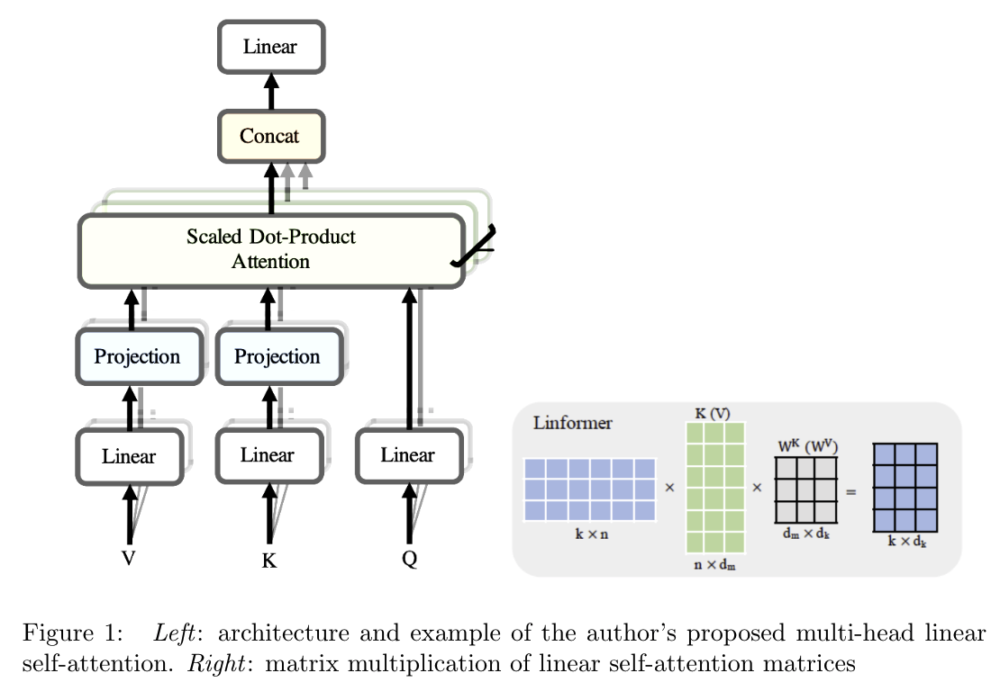
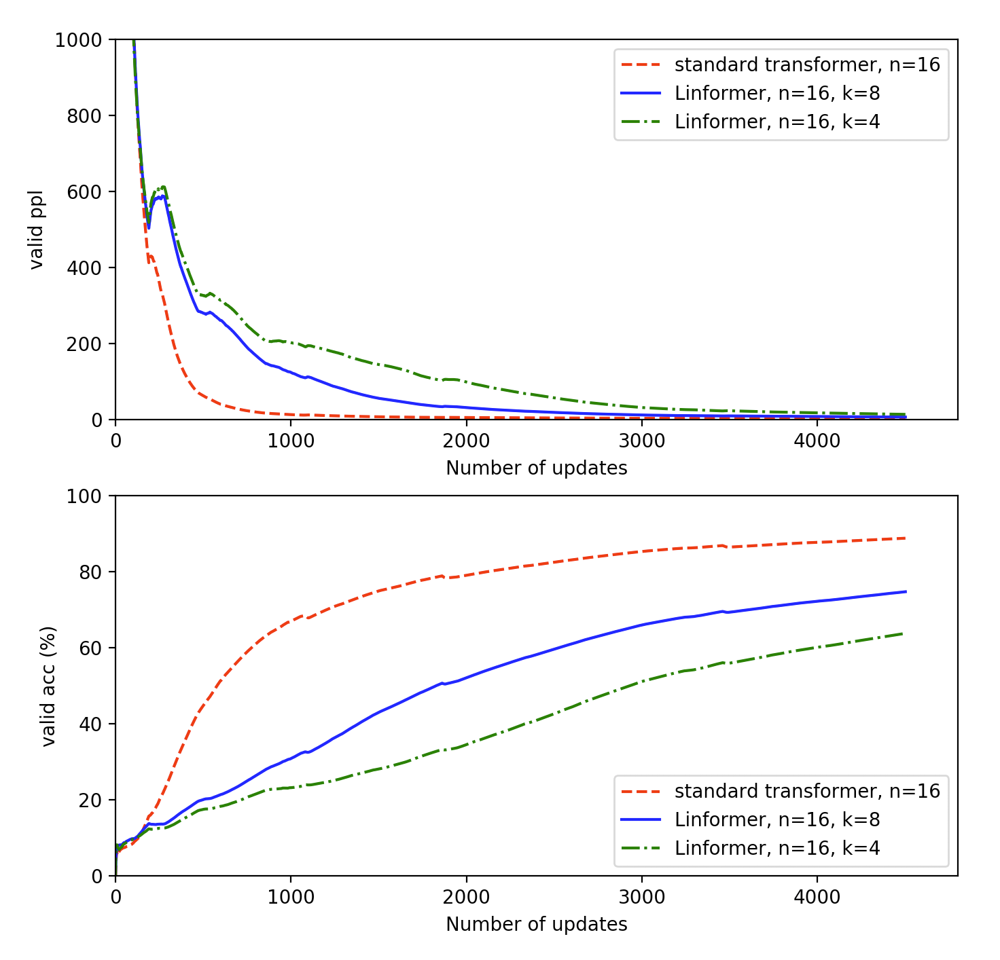
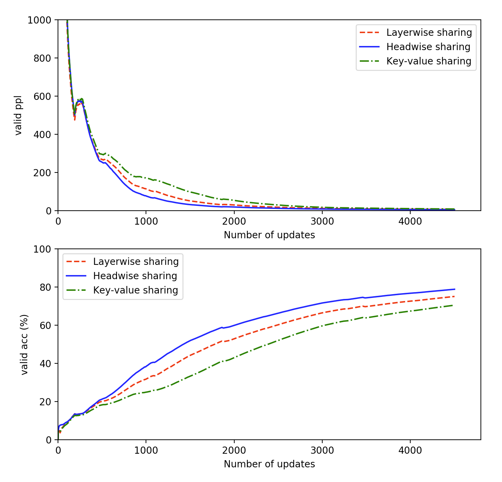
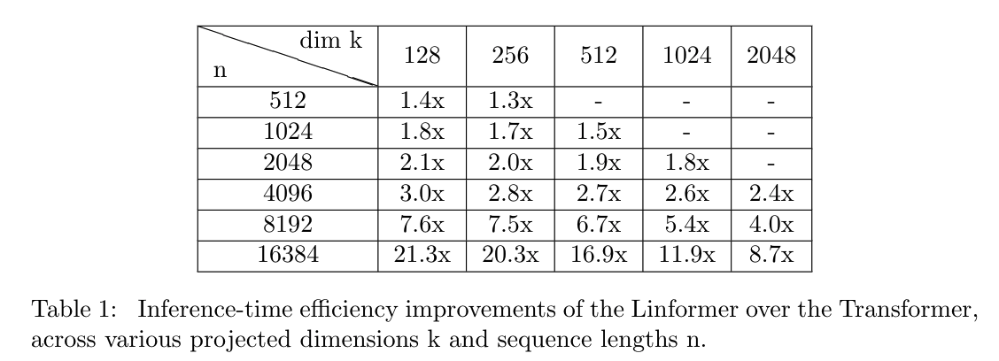

# Linformer: Self-Attention with Linear Complexity



This is the implementation from [Linformer: Self-Attention with Linear Complexity](https://arxiv.org/pdf/2006.04768v3.pdf), which improves transformer by making attention head computation linear O(n) regarding time and space complexity. Originally, vanilla transformer cost O(n^2) in both time and space complexity while computing attention head matrix.

We build the linear transformer model as well as seq2seq training model and provide training and test process to let users know what is the process going on through linear transformer. The data we use is from [bookcorpus](https://github.com/soskek/bookcorpus). We build a method to preprocess the data, padding and tokenize them, construct vocabulary, etc. Also, we save each training result to do further visualizion. 

Through our pre-training result on <strong>1 million words pre-training data set</strong>, we conclude that the perplexity and accuracy for linear transformer is as good as the vanilla one. Moreover, linear transformer provide better time perfomance. This can be shwon in <strong>model_complexity.exp.py</strong>

## Install
```
git clone git@github.com:Kyan820815/CSCI1470-Final-Project.git
cd CSCI1470-Final-Project
pip install -r requirements.txt
```

## Run
### preprocess, train and test
Put training data into data folder and run
```
python train_test.py	
```
### perform time complexity experiment
```
python model_complexity_exp.py	
```
### plot graph from experiment
Make sure you have pre-trained result inside result folder and run. It will output the visualization based on your pre-training result.
```
python plot.py	
```

## Variable Explanation
* num_tokens: size of vocab
* input_size: window_size for encoder & decoder
* channels: size of a word vector (before embedding)
* dim_d: inner size of head computation, like W_q: d_m x d_k, where d_k is dim_d and d_m is embedding size
* dim_k: main idea of paper
* dim_ff: size of ff layer
* nhead: number of head
* depth: how many encoder or decoder of one pass for transformer
* emb_dim: embedding size
* parameter_sharing: what level of parameter sharing to use.

## Data set
We use a smaller version of bookcorpus, which contains 1M words data set. The training set is already tokenized and can be directly used. Please download it from the below link and put it into the data folder.\
https://drive.google.com/file/d/12lKK2QKpcfDyJ_tXstcyLf2eqigjAiy4/view?usp=sharing

## Our result
### projection dimension k matters
We train the data set of 1 million words and the batch size is 100.
We demonstrate that linear transformer have simialar perplexity as vanilla one.


### parameter sharing
Also, the parameter sharing method shows that uses pairwise sharing can not only have the similar performance as the non-shared model but also save large memory space.


### time complexity analysis
Last, we benchmarked the model to test inference speed by  randomly  generating  data  up  tosome sequence length n and perform a full forward pass on a multiple batches. Below table shows the result.



